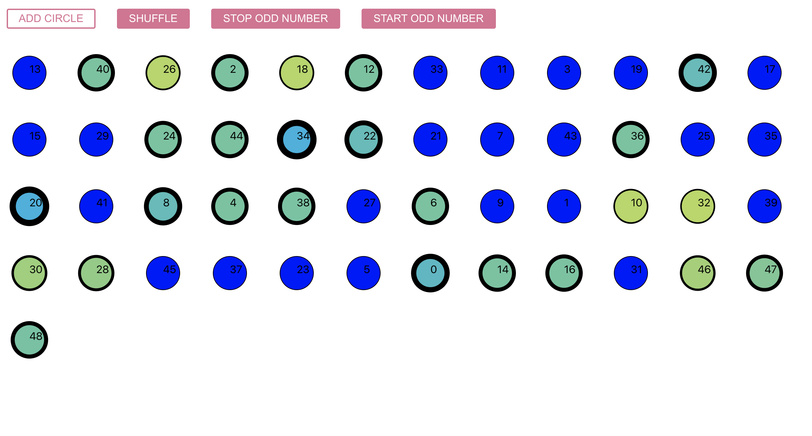

# Révision

Installez le projet svg-circle CRA & simpled-components. Nous allons générer un pavage à l'aide de cercles. Chaque cercle aura un numéro l'identifiant dans le rendu :



Vous devez utilisez un useReducer pour générer les cercles et définir les actions demandées. Aidez-vous du code du cercle SVG dans la partie document à la fin du TP.

Voici les fonctionnalités demandées :

1. Structurez le projet en créant les dossiers suivants :

```txt
reducers/
  circle.js
Styles/
  Button.js  <-- bouton de styled-components
  Circle.js  <--  Cercle SVG

App.js <-- Toutes les actions seront déclenchées dans cet unique composant.
```

2. Implémentez les actions (reducer) suivantes :

  - ADD CIRCLE cette action ajoutera un cercle SVG dans le rendu.
  - SHUFFLE  cette action permettra de modifier l'ordre d'affichage des cercles.
  - STOP_ODD cette action stopera l'animation des cercles impairs.
  - START ODD cette action lancera l'animation des cercles impairs.

3. Aspect graphique : utilisez des composants de styled-components pour placer les cercles dans le rendu. Les boutons, pour les actions, seront également codés avec un composant styled-components, ainsi que les cercles SVG.

4. En utilisant un useEffect. dessinez un carré tous les 7 cercles tracés.

5. Documents, voici le code que vous devez utiliser pour implémenter vos cercles en SVG. Pensez à les définir avec styled-components.

```js
<svg height="100" width="100" >
  <circle cx="50" cy="50" r="25" stroke="black" class="sc-cOajty gxZIjd"></circle>
  <text x="50" y="50">0</text>
</svg>
```